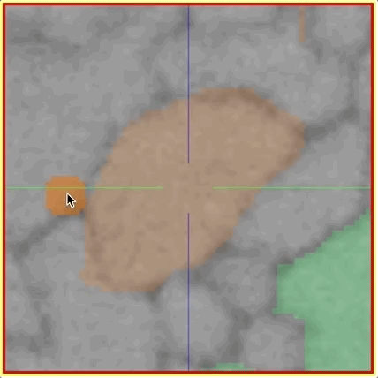

## Volume Annotations

In addition to [skeleton annotations](./skeleton_annotation.md), webKnossos also supports volume / segmentation annotations.
In this type of annotation, you can label groups of voxels with efficient drawing tools.



### Tools
Select one of the drawing tools from the toolbar or toggle through with the keyboard shortcut *W*.

- `Move`: Navigate around the dataset.
- `Trace`: Draw outlines around the voxel you would like to label.
- `Brush`: Draw over the voxels you would like to label. Adjust the brush size with *SHIFT + Mousewheel*.
- `Fill Tool`: Flood-fill the clicked region. All adjacent voxels with the same voxel id as the clicked voxel will be changed to the active cell id.

Add labels with *Left Mouse Drag*.
Remove labels with *Right Mouse Drag*.

In the `Segmentation` tab on the right-hand side, you can see the cell IDs which are active, below your cursor, or in the middle of the viewport.




### Proof-Reading and Merging Segments

webKnossos support proof-reading of segments from automatic segmentations. With "Merger Mode" individual segments (e.g. from over-segmentation) can be combined to refine the segmentation. 

The "merger mode" is available in skeleton and hybrid annotation mode. Mark connected segments by right clicking and placing nodes in the corresponding segments to merge them together. Several segments can be combined by making sure that all "correcting nodes" are part of the same tree.

"Merger mode" can be enabled in the settings under "Nodes & Trees" with the option "Enable Merger Mode". As soon as you enable it, all already existing trees will be used to form merged segments.

### Mappings / On-Demand Agglomeration
With webKnossos it is possible to apply a precomputed agglomeration file to combine over-segmented volume annotations on demand. This alleviates the demand to materialize agglomeration results prematurely and allows researchers to apply different agglomerations to the data for experimentation. We typically produce several agglomeration results based on different thresholds and methods and use webKnossos to quickly review these results on subsets of a dataset in an interactive session.



Mapping files are automatically identified by webKnossos when being placed in a "mappings" folder within the [segmentation folder](./data_formats.md#wkw-folder-structure). All available mappings can be activated from a dropdown in the "Segmentation" information pane, typically on the right-hand side of the screen. Due to their file size, mappings are fetched on demand before being applied. Users can easily switch between several mappings and webKnossos will update accordingly.

Mapping files are in JSON and need to follow this schema. All segment IDs belonging to the same super-voxel need to be listed in an array:  
```
{
  {
    "name": "astrocytes",
    "classes": [
      [
        69381,
        69445,
        138248
      ],
      [
        138307,
        343831
      ],
      [
        348348,
        132432,
        387433,
        338330
      ]
    ]
  }
}
```

<!--  -->

### Download File Format
Volume annotations can be downloaded and imported using ZIP files that contain [WKW](./data_formats.md#wkw-datasets) datasets.
The ZIP archive contains one NML file that holds meta information including the dataset name and the user's position.
Additionally, there is another embedded ZIP file that contains the volume annotations in WKW file format.


In contrast to on-disk WKW datasets, the WKW files in downloaded volume annotations only contain a single 32^3 bucket in each file.
Therefore, also the addressing of the WKW files (e.g. `z48/y5444/x5748.wkw`) is in steps of 32 instead of 1024.


```
volumetracing.zip # A ZIP file containing the volume annotation
├─ data.zip # Container for WKW dataset
│ └─ 1 # Magnification step folder
│   ├─ z48
│   │ ├─ y5444
│   │ │ └─ x5748.wkw # Actual WKW bucket file (32^3 voxel)
│   │ └─ y5445/...
│   ├─ z49/...
│   └─ header.wkw # Information about the WKW files
└─ volumetracing.nml # Annotation metadata NML file
```

After unzipping the archives, the WKW files can be read or modified with the WKW libraries that are available for [Python, MATLAB and other languages](https://github.com/scalableminds/webknossos-wrap/). 

## Hybrid Annotations

Hybrid annotations combine the functionality of skeleton and volume annotations.
In this type of annotation, you can, for example, use a guiding skeleton to support volume annotation tasks.
Alternatively, comments, that are usually only supported in skeleton annotations, could be used to label specific cells.

Skeleton or Volume annotations can be converted to hybrid annotations, by clicking the `Convert to Hybrid` button in the info tab.
This conversion cannot be reversed.
